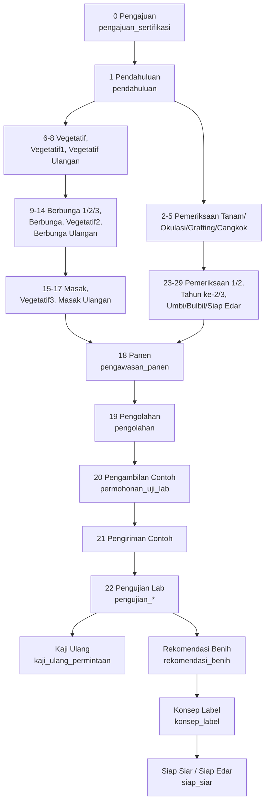

# Struktur Project — simbenih.new (Laravel 13)

> Dokumen acuan struktur untuk migrasi **SIMBENIH BPSB Jawa Timur** dari
> PHP 5.3 / CodeIgniter 1.7.x (`simbenih.bpsbjatim.com`) ke **Laravel 13 / PHP 8.3+** (`simbenih.new`).
>
> Aplikasi: Sistem Informasi Perbenihan — sertifikasi benih tanaman pangan & hortikultura
> (pengajuan, pemeriksaan fase lapangan, pasca lapangan, uji laboratorium, label & pelaporan).

Terakhir diperbarui: 2026-08-23

---

## 1. Ringkasan Proyek

| Aspek            | Aplikasi Lama                            | Aplikasi Baru                                |
| ---------------- | ---------------------------------------- | -------------------------------------------- |
| Direktori        | `simbenih.bpsbjatim.com/www`             | `simbenih.new`                               |
| Bahasa           | PHP 5.3                                  | PHP 8.3+ (lokal: 8.5)                        |
| Framework        | CodeIgniter 1.7.x (bundled di `system/`) | Laravel 13.26                                |
| Pola             | MVC klasik, PHP4-style constructor       | MVC + Service Layer, PSR-4, typed            |
| Front controller | `www/index.php` + `.htaccess`            | `public/index.php`                           |
| Autoload         | manual (`$this->load->model()`)          | Composer PSR-4 + DI Container                |
| Template         | PHP murni (`.php`)                       | Blade (`.blade.php`)                         |
| Grid/tabel       | Flexigrid + ExtJS + jQuery 1.2.6         | Tailwind 4 + Vite 8 (Blade komponen)         |
| Session          | CI cookie `benih_bpsb` (tanpa DB)        | Laravel session driver `database`            |
| Password         | `md5()` tanpa salt                       | `bcrypt` (`Hash::make`)                      |
| Laporan          | JasperReports (JVM) + mPDF + dompdf      | Blade → PDF / Excel (lihat §10)              |
| Database         | MySQL `simbenih`                         | MySQL `simbenih` (skema sama, fase transisi) |
| VCS              | SVN (folder `.svn` masih tertinggal)     | Git                                          |

### Skala aplikasi lama (basis pekerjaan migrasi)

| Komponen        | Jumlah                                                                             | Baris kode |
| --------------- | ---------------------------------------------------------------------------------- | ---------- |
| Controller      | 174 file (35 root + 8 sub-modul)                                                   | ~76.900    |
| Model           | 46 file                                                                            | ~8.060     |
| View            | 347 file                                                                           | ~167.600   |
| Library         | 5 file (`Wick`, `flexigrid`, `Jasper_report`, `Multi_upload`, `noinduk_generator`) | ~1.460     |
| Helper          | 2 file (`flexigrid_helper`, `login_helper`)                                        | ~210       |
| Tabel database  | 50 tabel                                                                           | —          |
| View database   | 38 view SQL                                                                        | —          |
| Template Jasper | 43 file `.jrxml` / `.jasper`                                                       | —          |
| Berkas upload   | 365 folder di `www/upload_file`                                                    | —          |
| Dump SQL        | `db/simbenih-2026-08-162-00.sql`                                                   | ~238 MB    |

### Sebaran controller lama per sub-modul

| Sub-modul             | File | Peran                                    |
| --------------------- | ---- | ---------------------------------------- |
| `controllers/` (root) | 35   | master data, auth, admin, backup         |
| `spesifik/`           | 21   | fase lapangan tipe spesifik              |
| `vegetatif1_/`        | 21   | fase lapangan vegetatif varian `_`       |
| `hibrida/`            | 20   | fase lapangan tanaman hibrida            |
| `laporan/`            | 18   | cetak & rekap laporan                    |
| `inhibrida/`          | 17   | fase lapangan inbrida                    |
| `vegetatif1/`         | 17   | fase pemeriksaan vegetatif (umbi/bulbil) |
| `pasca_lapangan/`     | 15   | pengambilan → label                      |
| `uji_lab/`            | 10   | pengujian laboratorium                   |

---

## 2. Kondisi `simbenih.new` Saat Ini

Status: **skeleton Laravel 13 + aset legacy yang sudah disalin**. Belum ada kode domain.

```
simbenih.new/
├── app/
│   ├── Http/Controllers/Controller.php     # abstract kosong (skeleton)
│   ├── Models/User.php                     # model bawaan Laravel, belum dipetakan ke tabel `users` legacy
│   └── Providers/AppServiceProvider.php    # kosong
├── bootstrap/app.php                       # middleware & exception belum dikonfigurasi
├── config/                                 # 10 file config bawaan (belum ada penyesuaian)
├── database/
│   ├── database.sqlite                     # masih SQLite (harus pindah ke MySQL)
│   ├── migrations/                         # 3 migrasi bawaan (users, cache, jobs)
│   ├── factories/UserFactory.php
│   └── seeders/DatabaseSeeder.php
├── public/
│   ├── css/  js/  images/                  # ⚠️ aset legacy hasil copy, termasuk 16 folder .svn
│   ├── index.php  .htaccess  robots.txt
│   └── favicon.ico
├── resources/
│   ├── css/app.css                         # Tailwind 4
│   ├── js/app.js                           # masih kosong
│   └── views/
│       ├── welcome.blade.php               # halaman bawaan Laravel
│       ├── beranda.php      ⚠️ view CI     # layout utama legacy
│       ├── home.php         ⚠️ view CI     # dashboard legacy
│       ├── menu_atas.php    ⚠️ view CI     # tab menu atas
│       ├── menu_kiri.php    ⚠️ view CI     # sidebar + hak akses per role
│       └── login/form_login.php ⚠️ view CI # form login + reCAPTCHA v2
├── routes/{web.php, console.php}            # hanya route `/`
├── storage/  tests/  vendor/
├── composer.json  package.json  vite.config.js  phpunit.xml
└── .env                                    # APP_NAME=Laravel, DB_CONNECTION=sqlite
```

### Catatan penting kondisi awal

1. **View legacy belum dikonversi.** `beranda.php`, `menu_kiri.php`, `form_login.php` masih memakai API CodeIgniter
   (`$this->session->userdata()`, `$this->db->get_where()`, `base_url()`, `anchor()`, `img()`, `form_open()`)
   dan short tag `<? ... ?>`. Semuanya harus dikonversi ke Blade.
2. **Belum ada repository Git** di `simbenih.new` (`git status` → not a repository).
3. **Sisa metadata SVN & macOS**: 16 folder `.svn` di `public/`, 1 di `resources/views/login/`, 4 file `.DS_Store`.
4. **Koneksi database masih SQLite**; `.env` masih memakai nilai default `APP_NAME=Laravel`.
5. **Model `User` masih bawaan** (kolom `name`, `email`), belum dipetakan ke tabel legacy `users`
   (`ID_USER`, `USERNAME`, `PASSWORD`, `ID_ROLE`, `ID_PEGAWAI`, `WEWENANG_DATA`, `KODE_KABUPATEN`).

---

## 3. Struktur Direktori Target

Pengelompokan mengikuti **domain bisnis**, bukan mengikuti nama file legacy, agar 174 controller lama
dapat dikonsolidasi menjadi struktur yang jauh lebih ringkas.

```
simbenih.new/
├── app/
│   ├── Console/
│   │   └── Commands/
│   │       ├── ImportLegacyDatabase.php        # impor dump simbenih-*.sql
│   │       ├── MigrateLegacyPasswords.php      # md5 → bcrypt (rehash saat login)
│   │       └── SyncOperatorData.php            # pengganti controllers/sinkronisasi.php
│   │
│   ├── Enums/
│   │   ├── FaseSertifikasi.php                 # 30 fase (0..29), dari tabel fase_sertifikasi
│   │   ├── TipeForm.php                        # HIBRIDA, INBRIDA, SPESIFIK, VEGETATIF1, VEGETATIF1_
│   │   ├── Role.php                            # 11 role (lihat §6)
│   │   ├── WewenangData.php                    # 0=Semua, 1=Pangan, 2=Hortikultura
│   │   ├── KesimpulanFase.php                  # lulus / tidak lulus / ditunda
│   │   └── StatusAktif.php                     # '1' aktif / '0' tidak aktif
│   │
│   ├── Exceptions/
│   │   └── FaseTidakValidException.php
│   │
│   ├── Http/
│   │   ├── Controllers/
│   │   │   ├── Controller.php
│   │   │   ├── BerandaController.php           # ← beranda.php, home.php
│   │   │   │
│   │   │   ├── Auth/
│   │   │   │   ├── LoginController.php         # ← login.php, logout.php, welcome.php
│   │   │   │   └── GantiPasswordController.php # ← ganti_password.php
│   │   │   │
│   │   │   ├── Master/                         # ← 19 controller atur_*.php
│   │   │   │   ├── KomoditasController.php     # "Master Golongan"
│   │   │   │   ├── GolonganController.php      # "Master Kumpulan"
│   │   │   │   ├── JenisTanamanController.php
│   │   │   │   ├── VarietasController.php
│   │   │   │   ├── GrupKelasBenihController.php
│   │   │   │   ├── KelasBenihController.php
│   │   │   │   ├── PenyakitController.php
│   │   │   │   ├── KabupatenController.php
│   │   │   │   ├── KecamatanController.php
│   │   │   │   ├── SatuanController.php
│   │   │   │   ├── SatgasController.php        # "Master Wilayah Kerja"
│   │   │   │   ├── StatusController.php
│   │   │   │   ├── ProdusenController.php
│   │   │   │   ├── PegawaiController.php
│   │   │   │   ├── MataAnggaranController.php
│   │   │   │   ├── KonfigurasiController.php
│   │   │   │   └── UserController.php
│   │   │   │
│   │   │   ├── Sertifikasi/
│   │   │   │   ├── PermohonanController.php    # ← data_permohonan.php
│   │   │   │   ├── PengajuanController.php     # ← */pengajuan_sertifikasi.php (5 varian)
│   │   │   │   ├── FaseLapanganController.php  # ← */fase_*.php (dipandu Enum FaseSertifikasi)
│   │   │   │   ├── KelasBenihLulusController.php # ← */set_kelas_benih.php
│   │   │   │   └── TanggalRealisasiController.php # ← */set_tgl_realisasi.php
│   │   │   │
│   │   │   ├── PascaLapangan/
│   │   │   │   ├── PascaPengajuanController.php    # ← pasca_pengajuan.php
│   │   │   │   ├── PengambilanController.php       # PCB - pengambilan contoh benih
│   │   │   │   ├── PengirimanController.php
│   │   │   │   ├── PengolahanController.php
│   │   │   │   ├── PermohonanUjiController.php
│   │   │   │   ├── RekomendasiBenihController.php
│   │   │   │   ├── KonsepLabelController.php
│   │   │   │   ├── KonsepLabelStandarController.php
│   │   │   │   ├── LhuLaboratoriumController.php
│   │   │   │   └── SiapSiarController.php
│   │   │   │
│   │   │   ├── UjiLab/
│   │   │   │   ├── PengujianController.php
│   │   │   │   ├── UjiKadarAirController.php
│   │   │   │   ├── UjiKemurnianFisikController.php
│   │   │   │   ├── UjiKemurnianGenetikController.php
│   │   │   │   ├── UjiDayaTumbuhController.php
│   │   │   │   ├── KajiUlangController.php         # + Buku Induk
│   │   │   │   └── SuratPerintahController.php
│   │   │   │
│   │   │   ├── Laporan/                        # ← 18 controller laporan/*
│   │   │   │   ├── LaporanLapanganController.php
│   │   │   │   ├── LaporanPendahuluanController.php
│   │   │   │   ├── LaporanPanenController.php
│   │   │   │   ├── LaporanPengolahanController.php
│   │   │   │   ├── LaporanPengambilanController.php
│   │   │   │   ├── LaporanPengirimanController.php
│   │   │   │   ├── LaporanRekomendasiController.php
│   │   │   │   ├── LaporanSertifikasiController.php
│   │   │   │   ├── LaporanSertifikatController.php
│   │   │   │   ├── LaporanLabelController.php
│   │   │   │   ├── LaporanHasilUjiController.php
│   │   │   │   ├── TandaTerimaController.php
│   │   │   │   └── RekapPenangkaranController.php
│   │   │   │
│   │   │   └── Admin/
│   │   │       ├── LogSertifikasiController.php   # ← atur_log.php
│   │   │       ├── LogLaboratoriumController.php  # ← atur_log_lab.php
│   │   │       ├── BackupController.php           # ← backups.php, fullbackups.php
│   │   │       ├── RestoreController.php          # ← restore.php
│   │   │       └── SinkronisasiController.php     # ← sinkronisasi.php
│   │   │
│   │   ├── Middleware/
│   │   │   ├── EnsureUserHasRole.php           # ← helper cek_hak_akses()
│   │   │   ├── ApplyWewenangData.php           # filter pangan/hortikultura
│   │   │   ├── ApplyTahunData.php              # filter tahun aktif dari session login
│   │   │   ├── ApplyWilayahKerja.php           # scoping per satgas / kabupaten
│   │   │   └── ForcePasswordChange.php         # ← kolom users.CHANGE_PASSWORD
│   │   │
│   │   ├── Requests/                           # pengganti CI form_validation
│   │   │   ├── Master/{Simpan*Request}.php
│   │   │   ├── Sertifikasi/{SimpanPengajuanRequest, SimpanFaseRequest}.php
│   │   │   ├── PascaLapangan/{...}Request.php
│   │   │   └── UjiLab/{...}Request.php
│   │   │
│   │   └── Resources/                          # bila nanti dibutuhkan API/JSON
│   │
│   ├── Models/
│   │   ├── Concerns/
│   │   │   ├── HasLegacySchema.php             # trait: PK custom, tanpa timestamps
│   │   │   ├── FilterWewenang.php
│   │   │   └── FilterTahun.php
│   │   │
│   │   ├── User.php                            # tabel `users`  (PK ID_USER)
│   │   ├── Role.php                            # tabel `roles`
│   │   ├── Pegawai.php
│   │   ├── Satgas.php
│   │   ├── SatgasEmail.php
│   │   ├── Produsen.php
│   │   ├── Kabupaten.php
│   │   ├── Kecamatan.php
│   │   ├── Komoditas.php
│   │   ├── Golongan.php
│   │   ├── JenisTanaman.php                    # 118 kolom — flag alur fase per tanaman
│   │   ├── Varietas.php
│   │   ├── GrupKelasBenih.php
│   │   ├── KelasBenih.php
│   │   ├── Penyakit.php
│   │   ├── Satuan.php
│   │   ├── StatusRef.php                       # tabel `status`
│   │   ├── MataAnggaran.php
│   │   ├── Perbanyakan.php
│   │   ├── Istilah.php
│   │   ├── JenisKertas.php
│   │   ├── Konfigurasi.php
│   │   ├── Standar.php                         # tabel `standard`
│   │   ├── StandarNilai.php                    # tabel `standard_nilai`
│   │   ├── MetodeUjiDayaTumbuh.php
│   │   │
│   │   ├── PengajuanSertifikasi.php            # 117 kolom — inti alur sertifikasi
│   │   ├── FaseSertifikasiRef.php              # tabel `fase_sertifikasi` (master 30 fase)
│   │   ├── Pendahuluan.php
│   │   ├── FaseTumbuh.php                      # 74 kolom — semua fase pertumbuhan
│   │   ├── Sample.php                          # SAMPLE1..SAMPLE16 per fase tumbuh
│   │   ├── PengawasanPanen.php
│   │   ├── Pengolahan.php
│   │   ├── PengolahanGabungan.php
│   │   ├── PengolahanAkses.php
│   │   ├── PermohonanUjiLab.php
│   │   ├── PengujianKadarAir.php
│   │   ├── PengujianKemurnianFisik.php
│   │   ├── PengujianKemurnianGenetik.php
│   │   ├── PengujianDayaTumbuh.php
│   │   ├── KajiUlangPermintaan.php
│   │   ├── RekomendasiBenih.php
│   │   ├── KonsepLabel.php
│   │   ├── KonsepLabelAudit.php
│   │   ├── SiapSiar.php
│   │   ├── FileUploaded.php
│   │   ├── Sinkronisasi.php
│   │   ├── Backup.php
│   │   ├── Log.php
│   │   ├── LogPengajuan.php
│   │   └── LogPengolahanGabungan.php
│   │
│   ├── Policies/
│   │   ├── PengajuanSertifikasiPolicy.php
│   │   ├── FaseLapanganPolicy.php
│   │   ├── PengujianPolicy.php
│   │   └── KonsepLabelPolicy.php
│   │
│   ├── Providers/
│   │   ├── AppServiceProvider.php
│   │   └── AuthServiceProvider.php
│   │
│   ├── Services/                               # logika bisnis dipindah dari controller legacy
│   │   ├── Sertifikasi/
│   │   │   ├── AlurFaseService.php             # ← */cari_fase_berikutnya.php
│   │   │   ├── PengajuanService.php
│   │   │   ├── FaseLapanganService.php
│   │   │   ├── KelasBenihService.php
│   │   │   └── PelimpahanService.php           # ID_PRODUSEN_LIMPAH / FASE_PELIMPAHAN
│   │   ├── PascaLapangan/
│   │   │   ├── PengambilanContohService.php
│   │   │   ├── PengolahanService.php
│   │   │   ├── RekomendasiService.php
│   │   │   └── KonsepLabelService.php
│   │   ├── UjiLab/
│   │   │   ├── PengujianService.php
│   │   │   └── PenilaianStandarService.php     # bandingkan hasil uji vs standard_nilai
│   │   ├── Penomoran/
│   │   │   ├── NoIndukGenerator.php            # ← libraries/noinduk_generator.php
│   │   │   ├── KodeUnikSertifikasiGenerator.php
│   │   │   └── NomorLabelGenerator.php         # LABEL_AWAL / LABEL_AKHIR
│   │   ├── Laporan/
│   │   │   ├── LaporanPdfService.php           # ← Jasper_report
│   │   │   └── LaporanExcelService.php         # ← report_excel.php
│   │   └── Backup/
│   │       ├── DatabaseBackupService.php
│   │       └── DatabaseRestoreService.php
│   │
│   ├── Support/
│   │   ├── TanggalHelper.php                   # ← safeDateFormat(), longDate(), validateDate()
│   │   ├── AngkaHelper.php
│   │   └── SessionContext.php                  # tahun_data, wewenang, satgas, kabupaten
│   │
│   └── View/
│       └── Components/
│           ├── Layout/{App, Auth, Cetak}.php
│           ├── DataTable.php                   # pengganti Flexigrid
│           ├── Form/{Input, Select, Date, Checkbox, Textarea}.php
│           ├── MenuKiri.php                    # ← menu_kiri.php
│           └── MenuAtas.php                    # ← menu_atas.php
│
├── bootstrap/
│   ├── app.php                                 # daftarkan alias middleware role/tahun/wewenang
│   ├── providers.php
│   └── cache/
│
├── config/
│   ├── app.php  auth.php  cache.php  database.php  filesystems.php
│   ├── logging.php  mail.php  queue.php  services.php  session.php
│   └── simbenih.php                            # ⭐ config domain: tahun default, fase, batas berat,
│                                               #   path upload, nomor induk, opsi cetak
│
├── database/
│   ├── migrations/
│   │   ├── 0001_01_01_000000_create_users_table.php   # (bawaan — tinjau ulang, lihat §5)
│   │   ├── 0001_01_01_000001_create_cache_table.php
│   │   ├── 0001_01_01_000002_create_jobs_table.php
│   │   └── legacy/                             # migrasi cerminan 50 tabel + 38 view SQL
│   ├── seeders/
│   │   ├── DatabaseSeeder.php
│   │   ├── RoleSeeder.php                      # 11 role
│   │   ├── FaseSertifikasiSeeder.php           # 30 fase
│   │   ├── KonfigurasiSeeder.php
│   │   └── ReferensiWilayahSeeder.php          # kabupaten & kecamatan
│   └── factories/
│
├── docs/
│   ├── STRUKTUR-PROJECT.md                     # dokumen ini
│   ├── SKEMA-DATABASE.md                       # (rencana) kamus 50 tabel + 38 view
│   ├── ALUR-SERTIFIKASI.md                     # (rencana) alur 30 fase per tipe form
│   └── PEMETAAN-LEGACY.md                      # (rencana) peta rute lama → rute baru
│
├── public/
│   ├── index.php  .htaccess  robots.txt  favicon.ico
│   ├── build/                                  # hasil `npm run build` (Vite)
│   └── legacy/                                 # ⭐ aset lama dipindah ke sini selama transisi
│       ├── css/  js/  images/
│
├── resources/
│   ├── css/app.css
│   ├── js/
│   │   ├── app.js
│   │   └── modules/{datatable.js, form-fase.js, autocomplete.js, cetak.js}
│   └── views/
│       ├── layouts/{app.blade.php, auth.blade.php, cetak.blade.php}
│       ├── components/                         # pasangan Blade untuk app/View/Components
│       ├── partials/{menu-kiri, menu-atas, user-info, notifikasi}.blade.php
│       ├── auth/{login, ganti-password}.blade.php
│       ├── beranda/index.blade.php
│       ├── master/<modul>/{index, form}.blade.php
│       ├── sertifikasi/
│       │   ├── permohonan/{index, form, detail}.blade.php
│       │   └── fase/{pendahuluan, vegetatif, berbunga, masak, panen, pengolahan,
│       │              pemeriksaan-umbi, ...}.blade.php
│       ├── pasca-lapangan/{pengambilan, pengiriman, pengolahan, permohonan-uji,
│       │                   rekomendasi, konsep-label, lhu, siap-siar}/
│       ├── uji-lab/{pengujian, kadar-air, kemurnian-fisik, kemurnian-genetik,
│       │            daya-tumbuh, kaji-ulang, surat-perintah}/
│       ├── laporan/<jenis>/…
│       ├── admin/{log, backup, restore, sinkronisasi}/
│       └── cetak/                              # template khusus PDF (kop, label, sertifikat)
│
├── routes/
│   ├── web.php                                 # entry: require file per domain
│   ├── auth.php
│   ├── master.php
│   ├── sertifikasi.php
│   ├── pasca-lapangan.php
│   ├── uji-lab.php
│   ├── laporan.php
│   ├── admin.php
│   └── console.php
│
├── storage/
│   ├── app/
│   │   ├── private/{backups/, upload/}         # ← www/upload_file, www/db_backups
│   │   └── public/
│   ├── framework/
│   └── logs/
│
├── tests/
│   ├── Feature/{Auth, Master, Sertifikasi, PascaLapangan, UjiLab, Laporan}/
│   └── Unit/{Services, Support, Enums}/
│
├── .env  .env.example
├── composer.json  package.json  vite.config.js  phpunit.xml
└── README.md
```

---

## 4. Pemetaan Modul Legacy → Laravel

### 4.1 Rute & controller

| Legacy (URI CI)                                                        | Rute baru                                            | Controller baru                              |
| ---------------------------------------------------------------------- | ---------------------------------------------------- | -------------------------------------------- | ------------------------------ |
| `welcome`, `login`, `logout`                                           | `GET /login`, `POST /login`, `POST /logout`          | `Auth\LoginController`                       |
| `beranda`                                                              | `GET /`                                              | `BerandaController@index`                    |
| `ganti_password`                                                       | `GET                                                 | PUT /ganti-password`                         | `Auth\GantiPasswordController` |
| `atur_komoditas/*`                                                     | `/master/komoditas` (resource)                       | `Master\KomoditasController`                 |
| `atur_golongan/*`                                                      | `/master/kumpulan`                                   | `Master\GolonganController`                  |
| `atur_jenis_tanaman/*`                                                 | `/master/jenis-tanaman`                              | `Master\JenisTanamanController`              |
| `atur_varietas/*`                                                      | `/master/varietas`                                   | `Master\VarietasController`                  |
| `atur_kelas_benih/*`                                                   | `/master/kelas-benih`                                | `Master\KelasBenihController`                |
| `atur_grup_kelas_benih/*`                                              | `/master/grup-kelas-benih`                           | `Master\GrupKelasBenihController`            |
| `atur_penyakit`, `atur_satuan`, `atur_status`                          | `/master/{penyakit,satuan,status}`                   | `Master\*Controller`                         |
| `atur_kabupaten`, `atur_kecamatan`                                     | `/master/{kabupaten,kecamatan}`                      | `Master\*Controller`                         |
| `atur_satgas`                                                          | `/master/wilayah-kerja`                              | `Master\SatgasController`                    |
| `atur_produsen`, `atur_pegawai`                                        | `/master/{produsen,pegawai}`                         | `Master\*Controller`                         |
| `atur_mata_anggaran`, `atur_konfigurasi`                               | `/master/{mata-anggaran,konfigurasi}`                | `Master\*Controller`                         |
| `atur_user`                                                            | `/master/user`                                       | `Master\UserController`                      |
| `data_permohonan/*`                                                    | `/sertifikasi/permohonan`                            | `Sertifikasi\PermohonanController`           |
| `hibrida/pengajuan_sertifikasi`                                        | `/sertifikasi/pengajuan?tipe=hibrida`                | `Sertifikasi\PengajuanController`            |
| `inhibrida/pengajuan_sertifikasi`                                      | `…?tipe=inbrida`                                     | idem                                         |
| `spesifik/pengajuan_sertifikasi`                                       | `…?tipe=spesifik`                                    | idem                                         |
| `vegetatif1/pengajuan_sertifikasi`                                     | `…?tipe=vegetatif1`                                  | idem                                         |
| `vegetatif1_/pengajuan_sertifikasi`                                    | `…?tipe=vegetatif1-alt`                              | idem                                         |
| `{tipe}/fase_pendahuluan`                                              | `/sertifikasi/{permohonan}/fase/pendahuluan`         | `Sertifikasi\FaseLapanganController`         |
| `{tipe}/fase_vegetatif`, `fase_vegetatif_ulangan`                      | `…/fase/vegetatif`, `…/fase/vegetatif-ulangan`       | idem                                         |
| `{tipe}/fase_berbunga1..3`, `fase_berbunga_ulangan`                    | `…/fase/berbunga-{1,2,3}`, `…/fase/berbunga-ulangan` | idem                                         |
| `{tipe}/fase_masak`, `fase_masak_ulangan`                              | `…/fase/masak`, `…/fase/masak-ulangan`               | idem                                         |
| `{tipe}/fase_panen`, `fase_pengolahan`                                 | `…/fase/panen`, `…/fase/pengolahan`                  | idem                                         |
| `vegetatif1/fase_pemeriksaan1..2`                                      | `…/fase/pemeriksaan-{1,2}`                           | idem                                         |
| `vegetatif1/fase_pemeriksaan_tahun_2..3`                               | `…/fase/pemeriksaan-tahun-{2,3}`                     | idem                                         |
| `vegetatif1/fase_pemeriksaan_umbi*`                                    | `…/fase/pemeriksaan-umbi[-tahun-{2,3}]`              | idem                                         |
| `{tipe}/cari_fase_berikutnya`                                          | (internal)                                           | `Services\Sertifikasi\AlurFaseService`       |
| `{tipe}/set_kelas_benih`                                               | `PUT …/kelas-benih`                                  | `Sertifikasi\KelasBenihLulusController`      |
| `{tipe}/set_tgl_realisasi`                                             | `PUT …/tanggal-realisasi`                            | `Sertifikasi\TanggalRealisasiController`     |
| `{tipe}/setting_menu_atas`, `load_data_*`                              | (dihapus)                                            | jadi partial Blade / komponen                |
| `pasca_lapangan/pasca_pengajuan`                                       | `/pasca-lapangan`                                    | `PascaLapangan\PascaPengajuanController`     |
| `pasca_lapangan/pengambilan`                                           | `/pasca-lapangan/pengambilan`                        | `PascaLapangan\PengambilanController`        |
| `pasca_lapangan/pengiriman`                                            | `/pasca-lapangan/pengiriman`                         | `PascaLapangan\PengirimanController`         |
| `pasca_lapangan/pengolahan`                                            | `/pasca-lapangan/pengolahan`                         | `PascaLapangan\PengolahanController`         |
| `pasca_lapangan/permohonan_uji`                                        | `/pasca-lapangan/permohonan-uji`                     | `PascaLapangan\PermohonanUjiController`      |
| `pasca_lapangan/rekomendasi_benih`                                     | `/pasca-lapangan/rekomendasi`                        | `PascaLapangan\RekomendasiBenihController`   |
| `pasca_lapangan/konsep_label`                                          | `/pasca-lapangan/konsep-label`                       | `PascaLapangan\KonsepLabelController`        |
| `pasca_lapangan/konsep_label_standart`                                 | `/pasca-lapangan/konsep-label-standar`               | `PascaLapangan\KonsepLabelStandarController` |
| `pasca_lapangan/Konsep_label_vegetatif`                                | `…/konsep-label?tipe=vegetatif`                      | `KonsepLabelController`                      |
| `pasca_lapangan/lhu_laboratorium`                                      | `/pasca-lapangan/lhu`                                | `PascaLapangan\LhuLaboratoriumController`    |
| `pasca_lapangan/siap_siar`                                             | `/pasca-lapangan/siap-siar`                          | `PascaLapangan\SiapSiarController`           |
| `pasca_lapangan/pilih_form`                                            | (dihapus)                                            | ditentukan `TipeForm` + `JenisTanaman`       |
| `uji_lab/pengujian`                                                    | `/uji-lab/pengujian`                                 | `UjiLab\PengujianController`                 |
| `uji_lab/uji_kadar_air`                                                | `/uji-lab/kadar-air`                                 | `UjiLab\UjiKadarAirController`               |
| `uji_lab/uji_kemurnian_fisik`                                          | `/uji-lab/kemurnian-fisik`                           | `UjiLab\UjiKemurnianFisikController`         |
| `uji_lab/uji_kemurnian_genetik`                                        | `/uji-lab/kemurnian-genetik`                         | `UjiLab\UjiKemurnianGenetikController`       |
| `uji_lab/uji_daya_tumbuh`                                              | `/uji-lab/daya-tumbuh`                               | `UjiLab\UjiDayaTumbuhController`             |
| `uji_lab/kaji_ulang`, `…/getBukuInduk`                                 | `/uji-lab/kaji-ulang`, `/uji-lab/buku-induk`         | `UjiLab\KajiUlangController`                 |
| `uji_lab/surat_perintah`                                               | `/uji-lab/surat-perintah`                            | `UjiLab\SuratPerintahController`             |
| `uji_lab/cetak_hasilUji_lab`, `laporan/cetak_hasilUji`                 | `/laporan/hasil-uji/{id}`                            | `Laporan\LaporanHasilUjiController`          |
| `laporan/laporan_lapangan_{hibrida,inbrida,vegetatif1}`                | `/laporan/lapangan/{tipe}`                           | `Laporan\LaporanLapanganController`          |
| `laporan/laporan_pendahuluan*`                                         | `/laporan/pendahuluan`                               | `Laporan\LaporanPendahuluanController`       |
| `laporan/laporan_panen_*`                                              | `/laporan/panen`                                     | `Laporan\LaporanPanenController`             |
| `laporan/laporan_pengolahan`                                           | `/laporan/pengolahan`                                | `Laporan\LaporanPengolahanController`        |
| `laporan/laporan_pengambilan`, `…_pengiriman`                          | `/laporan/{pengambilan,pengiriman}`                  | `Laporan\*Controller`                        |
| `laporan/laporan_rekomendasi`                                          | `/laporan/rekomendasi`                               | `Laporan\LaporanRekomendasiController`       |
| `laporan/laporan_sertifikasi*`                                         | `/laporan/sertifikasi`                               | `Laporan\LaporanSertifikasiController`       |
| `laporan/laporan_sertifikat{,_d}`                                      | `/laporan/sertifikat`                                | `Laporan\LaporanSertifikatController`        |
| `laporan/laporan_label`                                                | `/laporan/label`                                     | `Laporan\LaporanLabelController`             |
| `cetak_tandaTerima`, `laporan/cetak_tandaTerima`                       | `/laporan/tanda-terima/{id}`                         | `Laporan\TandaTerimaController`              |
| `cetak_pengiriman`, `cetak_rekomendasi`                                | `/laporan/{pengiriman,rekomendasi}/{id}/cetak`       | `Laporan\*Controller`                        |
| `laporan_penangkaran_produksi_per_varietas`                            | `/laporan/rekap/penangkaran-varietas`                | `Laporan\RekapPenangkaranController`         |
| `laporan_penangkaran_produksi_per_groupKB`                             | `/laporan/rekap/penangkaran-grup-kelas-benih`        | idem                                         |
| `atur_log`, `atur_log_lab`                                             | `/admin/log/{sertifikasi,laboratorium}`              | `Admin\Log*Controller`                       |
| `backups`, `fullbackups`                                               | `/admin/backup`                                      | `Admin\BackupController`                     |
| `restore`                                                              | `/admin/restore`                                     | `Admin\RestoreController`                    |
| `sinkronisasi`                                                         | `/admin/sinkronisasi`                                | `Admin\SinkronisasiController`               |
| `test_report`, `zaltan.php`, `contoh_form`, `form_tipe_hibrida_contoh` | **tidak dimigrasi**                                  | file uji/percobaan                           |

### 4.2 Konsolidasi yang direncanakan

| Legacy                                                           | Jumlah file | Menjadi                                                 | Alasan                                         |
| ---------------------------------------------------------------- | ----------- | ------------------------------------------------------- | ---------------------------------------------- |
| `{hibrida,inhibrida,spesifik,vegetatif1,vegetatif1_}/fase_*.php` | ~70         | 1 controller + `Enum FaseSertifikasi` + `Enum TipeForm` | logika hampir identik, hanya beda field & flag |
| `{tipe}/setting_menu_atas.php`                                   | 5           | komponen Blade `<x-menu-atas>`                          | murni presentasi                               |
| `{tipe}/load_data_*.php`                                         | ~12         | method AJAX di controller terkait                       | dulunya endpoint parsial                       |
| `{tipe}/cari_fase_berikutnya.php`                                | 5           | `AlurFaseService`                                       | satu algoritma untuk semua tipe                |
| `laporan/*`                                                      | 18          | 13 controller + `LaporanPdfService`                     | banyak yang hanya beda template                |
| `backups.php` + `fullbackups.php`                                | 2           | `Admin\BackupController`                                | duplikasi                                      |
| `Wick.php` (HMVC hack via `eval`)                                | 1           | **dihapus**                                             | diganti View Component / `@include`            |
| `flexigrid.php` + `flexigrid_helper.php`                         | 2           | **dihapus**                                             | diganti komponen `DataTable`                   |

---

## 5. Database & Konvensi Eloquent

### 5.1 Karakter skema legacy yang harus diakomodasi

Skema `simbenih` **tidak** mengikuti konvensi Laravel. Selama fase transisi skema dipertahankan
agar data 238 MB tidak perlu ditransformasi:

| Karakteristik                     | Contoh                                                                         | Penanganan                                                   |
| --------------------------------- | ------------------------------------------------------------------------------ | ------------------------------------------------------------ |
| Nama kolom HURUF BESAR            | `ID_USER`, `NAMA_PRODUSEN`                                                     | `$primaryKey`, `$fillable` eksplisit                         |
| Primary key tidak `id`            | `ID_PERMOHONAN`, `ID_FASE_LAPANGAN`                                            | `protected $primaryKey = 'ID_PERMOHONAN'`                    |
| Tabel tunggal (bukan plural)      | `produsen`, `varietas`, `pengolahan`                                           | `protected $table = 'produsen'`                              |
| Tanpa `created_at`/`updated_at`   | hampir semua tabel                                                             | `public $timestamps = false`                                 |
| Boolean sebagai `char(1)`         | `STATUS = '1'/'0'`, `flag_fase_* = 'Y'`                                        | cast custom / accessor                                       |
| Tanggal `date` + varchar campuran | `TGL_REALISASI_2 varchar(20)`                                                  | cast per kolom, jangan blanket                               |
| Nilai `'0000-00-00'`              | kolom tanggal lama                                                             | `safeDateFormat()` → `TanggalHelper`                         |
| Tabel sangat lebar                | `jenis_tanaman` 118 def, `pengajuan_sertifikasi` 117 def, `fase_tumbuh` 74 def | pisahkan concern lewat accessor/DTO, jangan pecah tabel dulu |
| Kolom berulang bernomor           | `PENYAKIT1..7`, `PENYAKIT_UMBI1..5`, `SAMPLE1..16`                             | accessor yang mengembalikan koleksi                          |
| 38 view SQL                       | `v_pengajuan_sertifikasi`, `V_PENGAMBILAN_CONTOH_BENIH`, `V_PROGRESS`, …       | model read-only atau Query Builder                           |

Contoh model dasar:

```php
namespace App\Models;

use App\Models\Concerns\HasLegacySchema;
use Illuminate\Database\Eloquent\Model;

class PengajuanSertifikasi extends Model
{
    use HasLegacySchema;

    protected $table = 'pengajuan_sertifikasi';
    protected $primaryKey = 'ID_PERMOHONAN';
    public $timestamps = false;

    protected function casts(): array
    {
        return [
            'TGL_PERMOHONAN' => 'date',
            'TGL_ENTRI' => 'date',
            'LUAS_AJU' => 'float',
            'PEMURNIAN_VARIETAS' => 'boolean',
        ];
    }

    public function produsen()
    {
        return $this->belongsTo(Produsen::class, 'ID_PRODUSEN', 'ID_PRODUSEN');
    }

    public function varietas()
    {
        return $this->belongsTo(Varietas::class, 'ID_VARIETAS', 'ID_VARIETAS');
    }

    public function faseTumbuh()
    {
        return $this->hasMany(FaseTumbuh::class, 'ID_PERMOHONAN', 'ID_PERMOHONAN');
    }
}
```

### 5.2 Daftar 50 tabel legacy per kelompok

**Referensi wilayah & organisasi (7)**
`kabupaten`, `kecamatan`, `satgas`, `satgas_email`, `pegawai`, `roles`, `users`

**Master benih & tanaman (11)**
`komoditas`, `golongan`, `jenis_tanaman`, `varietas`, `grup_kelas_benih`, `kelas_benih`,
`penyakit`, `satuan`, `perbanyakan`, `istilah`, `status`

**Master pendukung (6)**
`produsen`, `mata_anggaran`, `konfigurasi`, `jenis_kertas`, `standard`, `standard_nilai`

**Alur sertifikasi lapangan (6)**
`pengajuan_sertifikasi`, `fase_sertifikasi`, `pendahuluan`, `fase_tumbuh`, `sample`, `pengawasan_panen`

**Pasca lapangan (5)**
`pengolahan`, `pengolahan_gabungan`, `pengolahan_akses`, `rekomendasi_benih`, `siap_siar`

**Laboratorium (6)**
`permohonan_uji_lab`, `pengujian_kadar_air`, `pengujian_kemurnian_fisik`,
`pengujian_kemurnian_genetik`, `pengujian_daya_tumbuh`, `metode_uji_daya_tumbuh`

**Label & kaji ulang (3)**
`konsep_label`, `konsep_label_audit`, `kaji_ulang_permintaan`

**Sistem & audit (6)**
`log`, `log_pengajuan`, `log_pengolahan_gabungan`, `backups`, `sinkronisasi`, `file_uploaded`

### 5.3 Migrasi data & password

1. Impor dump: `php artisan simbenih:import-legacy db/simbenih-2026-08-162-00.sql`
2. Password legacy = `md5($password)` tanpa salt. Strategi: **rehash saat login pertama**.
   Cocokkan `md5()` dulu; bila cocok, simpan ulang dengan `Hash::make()`.
   Setelah masa transisi, jalankan `MigrateLegacyPasswords` untuk memaksa reset sisa akun.
3. Tabel `users` legacy tidak punya kolom `email`. Migrasi bawaan
   `0001_01_01_000000_create_users_table.php` **tidak digunakan** untuk auth utama —
   otentikasi memakai `username`. Migrasi bawaan boleh dihapus, atau `users` legacy
   ditambah kolom opsional (`email`, `remember_token`) via migrasi baru.
4. `sessions`, `cache`, `jobs` tetap memakai tabel Laravel (`SESSION_DRIVER=database`).

---

## 6. Autentikasi, Role, dan Scoping Data

### 6.1 Role (tabel `roles`, 11 baris)

| ID  | Kode        | Nama                  |
| --- | ----------- | --------------------- |
| 1   | `ADM_PRP`   | Super Admin           |
| 2   | `ADM_STG`   | Sertifikasi Satgas    |
| 3   | `SRT_PRP`   | Sertifikasi Propinsi  |
| 4   | `STR_STG`   | Sertifikasi Kabupaten |
| 5   | `LAB_PRP`   | Laboratorium Propinsi |
| 6   | `LAB_STG`   | Laboratorium Satgas   |
| 7   | `KA_BPSB`   | Kepala BPSB           |
| 8   | `KOOR_PROV` | Koordinator Provinsi  |
| 9   | `KOOR_WIL`  | Koordinator Wilayah   |
| 10  | `ADM`       | Administrator         |
| 11  | `ASIS`      | Asisten Korwil        |

Hak akses menu di aplikasi lama ditanam langsung di view
(`in_array($this->session->userdata('id_role'), array(1,2,3,4,9,10,11))`).
Di aplikasi baru dipindah ke **Gate/Policy** + middleware, lalu dipakai di Blade dengan `@can`.

Akses menu legacy yang perlu dipertahankan:

| Menu                                    | Role yang diizinkan   |
| --------------------------------------- | --------------------- |
| Sertifikasi (pengajuan & fase lapangan) | 1, 2, 3, 4, 9, 10, 11 |
| Pasca Lapangan                          | 1, 2, 3, 4, 9, 10, 11 |
| Konsep Label / Konsep Label Standar     | 1, 2, 9, 10, 11       |
| Laboratorium (uji, buku induk, log lab) | 1, 5, 6               |
| Data Master                             | 1, 10                 |
| Manajemen Aplikasi (log)                | 1, 9, 10              |
| Restore / Backup / Sinkronisasi         | 1                     |

### 6.2 Konteks sesi login

Aplikasi lama menyimpan konteks berikut ke session saat login; semuanya tetap dibutuhkan
dan dikelola oleh `App\Support\SessionContext`:

| Kunci legacy                   | Sumber                 | Fungsi di aplikasi baru                                            |
| ------------------------------ | ---------------------- | ------------------------------------------------------------------ |
| `id_user`, `username`          | `users`                | identitas                                                          |
| `id_role`, `role`              | `roles`                | otorisasi (Gate/Policy)                                            |
| `tahun_data`                   | dipilih di form login  | middleware `ApplyTahunData` (0 = semua tahun)                      |
| `wewenang`, `wewenang_data`    | `users.WEWENANG_DATA`  | middleware `ApplyWewenangData` (0=Semua, 1=Pangan, 2=Hortikultura) |
| `satgas`, `nama_satgas`        | `pegawai` → `satgas`   | middleware `ApplyWilayahKerja`                                     |
| `kode_kabupaten`               | `users.KODE_KABUPATEN` | scoping kabupaten                                                  |
| `id_pegawai`, `pegawai`, `nip` | `pegawai`              | tanda tangan dokumen & laporan                                     |
| `notification`                 | ad-hoc                 | diganti `session()->flash()`                                       |

### 6.3 Perbaikan keamanan yang wajib dilakukan

| Masalah di aplikasi lama                                                                | Perbaikan                                     |
| --------------------------------------------------------------------------------------- | --------------------------------------------- |
| Password `md5()` tanpa salt                                                             | `bcrypt` via `Hash`                           |
| Secret & site key reCAPTCHA di-hardcode di `controllers/login.php` dan `form_login.php` | pindah ke `.env` + `config/services.php`      |
| Verifikasi reCAPTCHA via `file_get_contents()` tanpa timeout/error handling             | `Http::timeout()` + penanganan gagal          |
| `$config['encryption_key'] = "arindrasaktiawan"` di repo                                | `APP_KEY` di `.env`                           |
| Kredensial DB di-hardcode di `config/database.php`                                      | `.env`                                        |
| `global_xss_filtering = TRUE` (filter global, bukan escaping output)                    | escaping otomatis Blade `{{ }}`               |
| Tidak ada proteksi CSRF                                                                 | middleware CSRF Laravel                       |
| SQL dirakit lewat Active Record CI tanpa binding konsisten                              | Eloquent / binding parameter                  |
| `display_errors on` di `.htaccess` produksi                                             | `APP_DEBUG=false` di produksi                 |
| `php_value memory_limit 2048M`, `max_execution_time 3600`                               | optimasi query + queue job untuk proses berat |

---

## 7. Alur Bisnis Sertifikasi (acuan struktur `Sertifikasi/`)

Tabel `fase_sertifikasi` mendefinisikan 30 fase (ID 0–29). Fase mana yang aktif untuk suatu
permohonan ditentukan oleh **flag di `jenis_tanaman`** (`PENDAHULUAN`, `VEGETATIF`, `BERBUNGA1`,
`MASAK`, `PANEN`, `PENGOLAHAN`, `PEMERIKSAAN_SAAT_TANAM`, dst.) dan dicatat progresnya lewat
`pengajuan_sertifikasi.flag_fase_*` serta `flag_fase_terakhir`.



Semua fase pertumbuhan (6–17) disimpan pada **satu tabel `fase_tumbuh`** yang dibedakan oleh
kolom `LEVEL_FASE` (FK ke `fase_sertifikasi`). Inilah alasan ~70 controller fase legacy dapat
dikonsolidasi menjadi satu `FaseLapanganController` + `AlurFaseService`.

Lima tipe form legacy dipetakan ke `App\Enums\TipeForm`:

| Tipe             | Folder legacy  | Karakter                                           |
| ---------------- | -------------- | -------------------------------------------------- |
| `HIBRIDA`        | `hibrida/`     | ada induk jantan & betina, isolasi, tebar bertahap |
| `INBRIDA`        | `inhibrida/`   | satu sumber benih                                  |
| `SPESIFIK`       | `spesifik/`    | fase disesuaikan per komoditas                     |
| `VEGETATIF1`     | `vegetatif1/`  | pemeriksaan 1/2, tahun ke-2/3, umbi/bulbil         |
| `VEGETATIF1_ALT` | `vegetatif1_/` | varian vegetatif dengan fase berbunga              |

---

## 8. Pelaporan & Cetak

### 8.1 Kondisi lama

- **JasperReports**: 43 file di `www/template/` (`.jrxml` + `.jasper`), dipanggil lewat
  `libraries/Jasper_report.php` yang menjalankan JVM dan koneksi JDBC
  (`jdbc:mysql://…` dibangun di `config/database.php`).
- **mPDF** dan **dompdf** di-bundle di `system/plugins/` (versi sangat lama).
- Ekspor Excel lewat `pasca_lapangan/report_excel.php` dan `uji_lab/report_excel.php`.

### 8.2 Target

| Kebutuhan                    | Pendekatan baru                                                                                                        |
| ---------------------------- | ---------------------------------------------------------------------------------------------------------------------- |
| Laporan PDF                  | Blade (`resources/views/cetak/`) → PDF via paket PHP modern (mis. `barryvdh/laravel-dompdf` atau `spatie/laravel-pdf`) |
| Label benih (presisi posisi) | Blade + CSS `@page` khusus; simpan preset ukuran di tabel `jenis_kertas`                                               |
| Sertifikat & tanda terima    | template Blade terpisah dengan komponen kop (`template/kop.jpg` → `public/legacy/images`)                              |
| Rekap/ekspor Excel           | `LaporanExcelService` (mis. `maatwebsite/excel`)                                                                       |
| Laporan berat / banyak baris | dijalankan sebagai queue job, hasil diunduh dari `storage/app/private`                                                 |

> **Keputusan yang perlu diambil:** apakah 43 template Jasper akan ditulis ulang sebagai Blade
> (menghilangkan dependensi JVM, direkomendasikan) atau JasperReports tetap dipertahankan sebagai
> service terpisah. Daftar template ada di `simbenih.bpsbjatim.com/www/template/`.

---

## 9. Frontend & Aset

### 9.1 Stack

|       | Lama                                                                        | Baru                                                       |
| ----- | --------------------------------------------------------------------------- | ---------------------------------------------------------- |
| CSS   | 12 file CSS manual (`main.css`, `flexigrid.css`, `ext-alll.css`, …)         | Tailwind CSS 4 (`@tailwindcss/vite`)                       |
| JS    | jQuery 1.2.6 / 1.3.1, ExtJS 2, Flexigrid, jquery.layout, blockUI, MultiFile | Vite 8 + modul ES di `resources/js/modules/`               |
| Build | tanpa build step                                                            | `npm run dev` / `npm run build`                            |
| Font  | default browser                                                             | `bunny('Instrument Sans')` via `laravel-vite-plugin/fonts` |

### 9.2 Komponen pengganti

| Komponen legacy                                          | Pengganti                                         |
| -------------------------------------------------------- | ------------------------------------------------- |
| Flexigrid (`build_grid_js()`, `flexigrid->json_build()`) | `<x-data-table>` — server-side paging/sort/filter |
| `$.growlUI('Pesan :', …)` untuk notifikasi               | komponen `<x-notifikasi>` + `session()->flash()`  |
| `datepicker.js`                                          | input `type="date"` / komponen `<x-form.date>`    |
| `jquery.layout.js` (panel kiri/tengah/kanan)             | layout Tailwind (grid/flex)                       |
| `tab-view.js` + `setting_menu_atas.php`                  | `<x-menu-atas>`                                   |
| `ext-combo.js` (combo AJAX)                              | `<x-form.select>` + endpoint JSON                 |
| `jquery.MultiFile.js`                                    | input `multiple` + validasi Laravel               |
| `shortcut.js`                                            | opsional, tidak diprioritaskan                    |

### 9.3 Penanganan aset legacy

Aset lama (12 folder CSS, 21 folder JS, 22 folder gambar) sudah tersalin ke `public/{css,js,images}`.
Rencana:

1. Pindahkan ke `public/legacy/{css,js,images}` agar tidak bercampur dengan output Vite di `public/build`.
2. Pertahankan hanya **gambar** yang masih dipakai (logo, kop, favicon, ikon menu di `images/main/`).
3. Hapus CSS/JS legacy setelah modul terkait dikonversi ke Blade + Tailwind.
4. Hapus seluruh folder `.svn` (16 di `public/`, 1 di `resources/views/login/`) dan file `.DS_Store` (4 file).

### 9.4 Berkas unggahan

| Lama                            | Baru                                                            |
| ------------------------------- | --------------------------------------------------------------- |
| `www/upload_file/` (365 folder) | `storage/app/private/upload/` + symlink bila perlu akses publik |
| `www/db_backups/`               | `storage/app/private/backups/`                                  |
| `www/logs/`, `www/error_log`    | `storage/logs/` (channel `stack`)                               |
| tabel `file_uploaded`           | model `FileUploaded` + `Storage` facade                         |

---

## 10. Konfigurasi Environment

`.env` saat ini masih memakai nilai default skeleton. Nilai target:

```dotenv
APP_NAME="SIMBENIH BPSB Jatim"
APP_ENV=local
APP_KEY=base64:…
APP_DEBUG=true
APP_URL=http://simbenih.test
APP_TIMEZONE=Asia/Jakarta          # legacy: date_default_timezone_set('Asia/Jakarta')
APP_LOCALE=id
APP_FALLBACK_LOCALE=id
APP_FAKER_LOCALE=id_ID

DB_CONNECTION=mysql                # legacy memakai MySQL, bukan SQLite
DB_HOST=127.0.0.1
DB_PORT=3306
DB_DATABASE=simbenih
DB_USERNAME=…
DB_PASSWORD=…
DB_CHARSET=utf8mb4
DB_COLLATION=utf8mb4_unicode_ci    # legacy: utf8 / utf8_general_ci

SESSION_DRIVER=database
SESSION_LIFETIME=120               # legacy sess_expiration = 7200 detik (=120 menit)
SESSION_COOKIE=simbenih_session    # legacy: benih_bpsb

CACHE_STORE=database
QUEUE_CONNECTION=database
FILESYSTEM_DISK=local

RECAPTCHA_SITE_KEY=…               # dipindah dari hardcode di form_login.php
RECAPTCHA_SECRET_KEY=…             # dipindah dari hardcode di controllers/login.php

SIMBENIH_TAHUN_MINIMAL=2011        # rentang pilihan tahun di form login
SIMBENIH_UPLOAD_DISK=local
```

Config domain baru `config/simbenih.php` menampung nilai yang di aplikasi lama tersebar di
`config/config.php`, `config/flexigrid.php`, dan tabel `konfigurasi`:

```php
return [
    'tahun' => [
        'minimal' => (int) env('SIMBENIH_TAHUN_MINIMAL', 2011),
    ],
    'upload' => [
        'disk' => env('SIMBENIH_UPLOAD_DISK', 'local'),
        'path' => 'upload',
        'max_size' => 10 * 1024,
    ],
    'tabel' => [
        'per_halaman' => 10,
        'opsi_per_halaman' => [5, 10, 15, 20, 25, 40],   // legacy rpOptions
    ],
    'cetak' => [
        'kop' => 'legacy/images/kop.jpg',
    ],
];
```

---

## 11. Roadmap Migrasi Bertahap

| Tahap                        | Lingkup                                                                                                                                                                                                          | Keluaran                                                                  |
| ---------------------------- | ---------------------------------------------------------------------------------------------------------------------------------------------------------------------------------------------------------------- | ------------------------------------------------------------------------- |
| **0. Persiapan**             | `git init`; bersihkan `.svn` & `.DS_Store`; pindah aset ke `public/legacy`; set `.env` MySQL; impor dump                                                                                                         | repo bersih, aplikasi terhubung ke DB `simbenih`                          |
| **1. Fondasi**               | `config/simbenih.php`; Enum (`Role`, `FaseSertifikasi`, `TipeForm`, `WewenangData`); trait `HasLegacySchema`; `SessionContext`; `TanggalHelper`; middleware role/tahun/wewenang; layout Blade + `<x-data-table>` | kerangka teknis siap                                                      |
| **2. Autentikasi**           | `LoginController` (username + tahun + reCAPTCHA), rehash md5→bcrypt, `ForcePasswordChange`, `GantiPasswordController`, konversi `form_login.php` → Blade                                                         | user dapat login                                                          |
| **3. Layout & Menu**         | `beranda.php` → `layouts/app.blade.php`; `menu_kiri.php` → `<x-menu-kiri>` dengan `@can`; `home.php` → dashboard                                                                                                 | kerangka UI berjalan                                                      |
| **4. Master Data**           | 17 modul master + model + Form Request + seeder referensi                                                                                                                                                        | CRUD master lengkap (modul paling sederhana, baik untuk memantapkan pola) |
| **5. Log & Audit**           | `Log`, `LogPengajuan`, observer pencatat aktivitas (pengganti `log_model->log()`)                                                                                                                                | jejak audit setara legacy                                                 |
| **6. Sertifikasi**           | `PermohonanController`, `PengajuanController`, `AlurFaseService`, `FaseLapanganController`, `NoIndukGenerator`                                                                                                   | inti aplikasi (tahap terbesar)                                            |
| **7. Pasca Lapangan**        | pengambilan → pengiriman → pengolahan → permohonan uji                                                                                                                                                           | rantai pasca panen                                                        |
| **8. Uji Laboratorium**      | 4 jenis pengujian + `PenilaianStandarService` + kaji ulang + buku induk                                                                                                                                          | modul lab                                                                 |
| **9. Rekomendasi & Label**   | `RekomendasiBenihController`, `KonsepLabelController`, `SiapSiarController`                                                                                                                                      | keluaran akhir sertifikasi                                                |
| **10. Pelaporan**            | 13 controller laporan + `LaporanPdfService` + `LaporanExcelService`                                                                                                                                              | menggantikan JasperReports                                                |
| **11. Admin & Sinkronisasi** | backup, restore, sinkronisasi data operator                                                                                                                                                                      | operasional                                                               |
| **12. Pengujian & Rilis**    | Feature test per modul, uji paralel dengan aplikasi lama, cutover                                                                                                                                                | rilis produksi                                                            |

**Prinsip urutan:** tahap 4 (Master Data) dikerjakan lebih dulu karena polanya paling seragam
(19 controller legacy hampir identik) sehingga pola `DataTable`, Form Request, dan Policy dapat
dimantapkan sebelum masuk ke tahap 6 yang paling kompleks.

---

## 12. Konvensi Coding

### Penamaan

| Elemen              | Konvensi                                        | Contoh                                   |
| ------------------- | ----------------------------------------------- | ---------------------------------------- |
| Controller          | `PascalCase` + `Controller`, singular           | `KelasBenihController`                   |
| Model               | `PascalCase` singular, istilah domain Indonesia | `PengajuanSertifikasi`, `FaseTumbuh`     |
| Service             | `PascalCase` + `Service`                        | `AlurFaseService`                        |
| Enum                | `PascalCase` singular                           | `FaseSertifikasi`                        |
| Form Request        | `Simpan…Request`, `Ubah…Request`                | `SimpanPengajuanRequest`                 |
| Route name          | `dot.case` sesuai hierarki                      | `sertifikasi.fase.pendahuluan`           |
| URL                 | `kebab-case`, bahasa Indonesia                  | `/pasca-lapangan/konsep-label`           |
| View                | `kebab-case`, folder = modul                    | `sertifikasi/fase/pendahuluan.blade.php` |
| Kolom DB            | **tetap** seperti legacy (HURUF BESAR)          | `ID_PERMOHONAN`                          |
| Variabel/method PHP | `camelCase`                                     | `$idPermohonan`, `simpanFase()`          |
| Kunci config        | `snake_case`                                    | `simbenih.tabel.per_halaman`             |

### Aturan

1. **Bahasa domain tetap Indonesia** (fase, varietas, kelas benih, satgas, produsen) agar sinkron
   dengan istilah pengguna dan skema database. Kata kunci teknis tetap Inggris (`Controller`, `Service`).
2. **Controller tipis.** Validasi di Form Request, logika bisnis di Service, query di Model/Scope.
   Aplikasi lama punya controller ratusan baris berisi HTML dan JS inline — pola ini tidak diulang.
3. **Tanpa HTML/JS di dalam PHP.** Legacy menyusun `<script>` sebagai string di controller
   (mis. `$data['added_js']`); di aplikasi baru semuanya di Blade / `resources/js`.
4. **Tanpa akses DB dari view.** `beranda.php` legacy memanggil `$this->db->get_where('users', …)`;
   data harus dikirim dari controller atau View Component.
5. `declare(strict_types=1)` pada file baru, type hint parameter & return.
6. Format kode dengan **Laravel Pint** (`composer exec pint`) sebelum commit.
7. Setiap modul minimal punya satu Feature test (happy path + otorisasi role).
8. Query berat (rekap, laporan lintas tahun) memakai view SQL yang sudah ada atau Query Builder,
   bukan `N+1` Eloquent.

### Perkakas tersedia

| Paket                   | Kegunaan                                           |
| ----------------------- | -------------------------------------------------- |
| `laravel/tinker` ^3.0   | REPL untuk eksplorasi data legacy                  |
| `laravel/pail` ^1.2     | tail log real-time                                 |
| `laravel/pao` ^1.0      | perkakas pengembangan Laravel                      |
| `laravel/pint` ^1.27    | formatter kode                                     |
| `phpunit/phpunit` ^12.5 | pengujian                                          |
| `fakerphp/faker` ^1.23  | factory data uji                                   |
| `@laravel/multiplex`    | dukungan `php artisan dev` (Vite + server + queue) |

---

## 13. Housekeeping Sebelum Mulai Ngoding

Daftar tindakan konkret pada `simbenih.new`:

- [ ] `git init` + `.gitignore` (sudah ada dari skeleton) lalu commit awal
- [ ] Hapus 16 folder `.svn` di `public/` dan 1 di `resources/views/login/`
- [ ] Hapus 4 file `.DS_Store`; tambahkan `.DS_Store` ke `.gitignore`
- [ ] Hapus `docs/test.md` (file uji dokumen ini)
- [ ] Pindahkan `public/{css,js,images}` → `public/legacy/{css,js,images}`
- [ ] Ubah `.env`: `APP_NAME`, `APP_TIMEZONE=Asia/Jakarta`, `APP_LOCALE=id`, `DB_CONNECTION=mysql`
- [ ] Hapus `database/database.sqlite` setelah pindah ke MySQL
- [ ] Impor `simbenih.bpsbjatim.com/db/simbenih-2026-08-162-00.sql` ke DB lokal
- [ ] Buat `config/simbenih.php`
- [ ] Buat direktori `docs/`, `app/Enums/`, `app/Services/`, `app/Support/`, `routes/` per domain
- [ ] Tinjau ulang migrasi `create_users_table` bawaan (auth memakai tabel `users` legacy)
- [ ] Pindahkan view legacy (`beranda.php`, `home.php`, `menu_*.php`, `login/form_login.php`)
      ke `docs/legacy-views/` sebagai referensi, agar `resources/views/` hanya berisi Blade
- [ ] Jalankan `npm install && npm run build` untuk memverifikasi Vite 8 + Tailwind 4

---

## 14. Referensi Cepat ke Aplikasi Lama

| Yang dicari              | Lokasi di `simbenih.bpsbjatim.com`                                    |
| ------------------------ | --------------------------------------------------------------------- |
| Controller               | `www/system/application/controllers/`                                 |
| Model                    | `www/system/application/models/`                                      |
| View                     | `www/system/application/views/`                                       |
| Konfigurasi CI           | `www/system/application/config/{config,database,routes,autoload}.php` |
| Helper domain            | `www/system/application/helpers/login_helper.php`                     |
| Generator nomor induk    | `www/system/application/libraries/noinduk_generator.php`              |
| Jembatan Jasper          | `www/system/application/libraries/Jasper_report.php`                  |
| Template laporan         | `www/template/*.jrxml`                                                |
| Manual pengguna          | `www/doc/User_Manual_Sistem_Informasi_Sistem_Perbenihan.docx`         |
| Dump database            | `db/simbenih-2026-08-162-00.sql` (~238 MB, 50 tabel, 38 view)         |
| Konfigurasi Apache/PHP   | `apache/apache2/`, `php/`, `Dockerfile`                               |
| Berkas unggahan produksi | `www/upload_file/` (365 folder)                                       |
